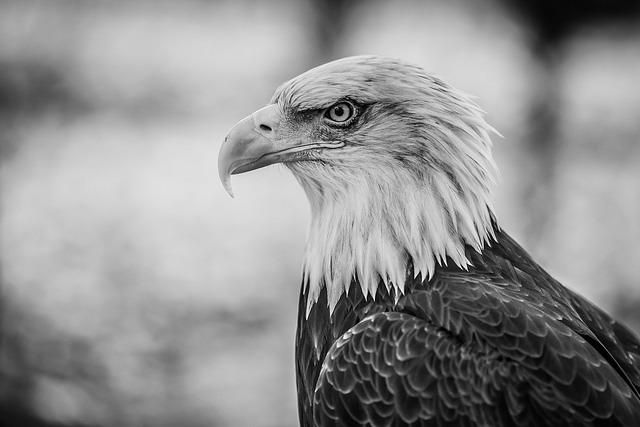

# Colorize AI – Black and White to Image Colorization using Deep Learning

This project is a deep learning application that **automatically colorizes grayscale images** using a pre-trained neural network model. It leverages OpenCV for image manipulation and a Caffe-based model to generate realistic color predictions.

---

## Sample Result

| Input (B&W) | Output (Colorized) |
|-------------|--------------------|
|  |  |

---

## How It Works

- Converts grayscale input to **LAB color space**
- Uses a **Caffe deep learning model** trained on color image datasets
- Predicts the 'a' and 'b' color channels from the L (lightness) channel
- Merges and converts LAB back to BGR for viewing

---

## Tech Stack

- **Language:** Python 
- **Libraries:** OpenCV, NumPy  
- **Model:** Pre-trained Caffe `.prototxt` and `.caffemodel`  
- **Frameworks:** Deep Learning with OpenCV’s DNN module

---

## 📁 File Structure

- BWopencv/
  |--b2w.py      # Main script to colorize images
  |--images/     # Folder containing input B&W images
     |--Eagle.jpg
     |--Lion.jpg
     |--rma.jpg
     |--Santiago.jpg
     |--wizard.jpg
     |--zidane.jpg
  |--models/      # Pre-trained model files for colorization
  |    |--colorization_deploy_v2.prototxt
  |    |--colorization_release_v2.caffemodel
  |    |--pts_in_null.py
  |----README.md  # Project documentation

  ---
